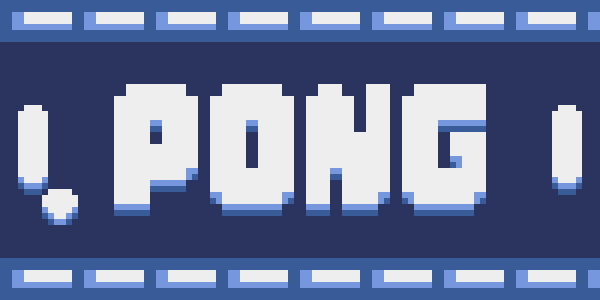

<header>

</header>

  <h3>Sobre o projeto</h3>
  

  <h4>🚧⚠️Em desenvolvimento...⚠️🚧</h4>

  
Criando clone do game retro "Pong"

  
Criado através da linguagem python, utilizando a interface gráfica da game engine Pyxel.

  

    
    
  

  <h3>Resultado</h3>
  <figure>
    
   
  </figure>

